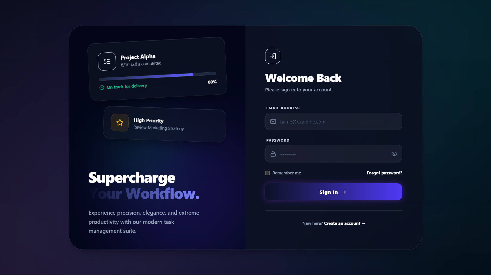
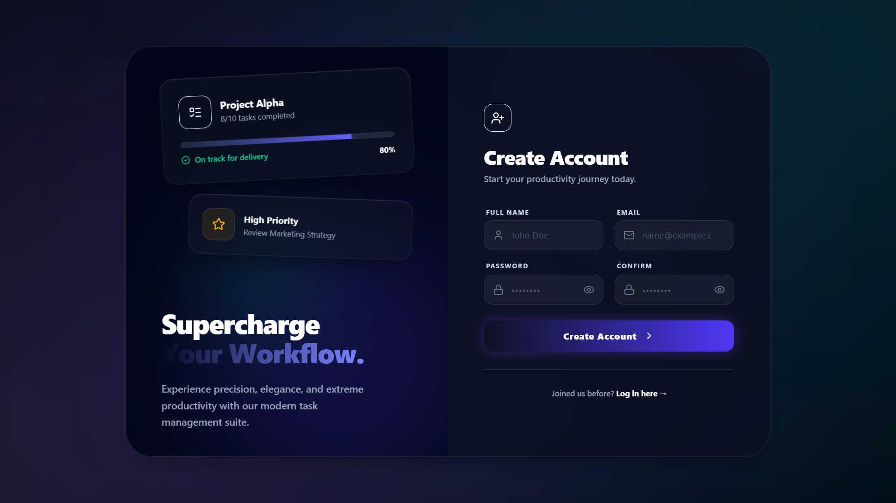
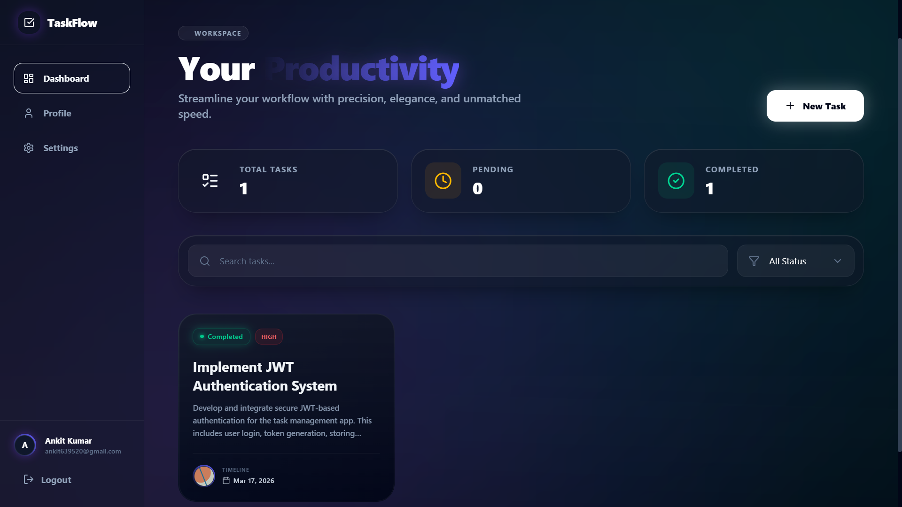
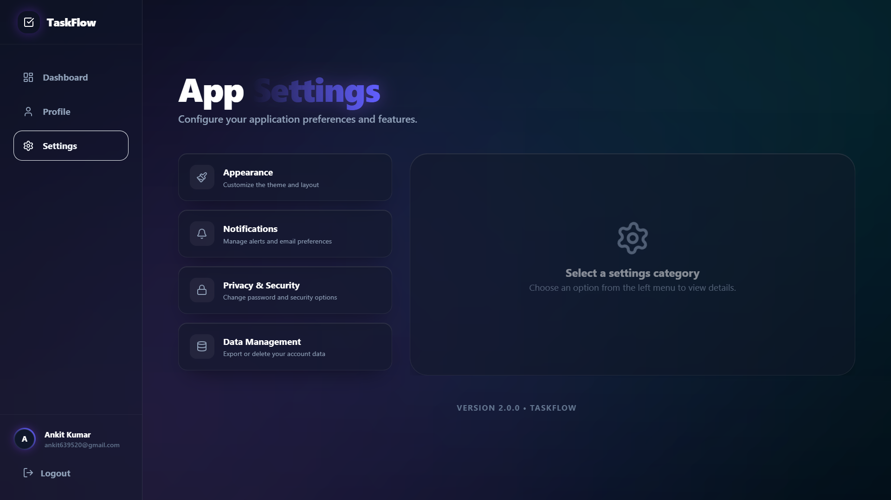

# Task Management Application

A full-stack Task Management application featuring user authentication, protected routes, a beautiful glassmorphism dark theme UI, and RESTful API integration. 

## 🔗 Project Links

- **Live Application**: [myraid-full-stack-developer-technical.onrender.com](https://myraid-full-stack-developer-technical.onrender.com)
- **Backend API**: [myraid-server.onrender.com/api](https://myraid-server.onrender.com/api)
- **Frontend Source**: [`./client`](./client)
- **Backend Source**: [`./server`](./server)

## 🏗️ Architecture Explanation

This application follows a modern MERN (MongoDB, Express, React, Node.js) Architecture:

### Frontend (Client)
- **Framework**: React.js with Vite for fast bundling and development.
- **Routing**: React Router DOM (`v7`) for client-side routing and authenticated protected routes.
- **State Management**: Context API (`AuthContext`) for managing user authentication state and session across the application.
- **Styling**: Tailwind CSS with custom global glassmorphism effects and animations (`framer-motion`).
- **HTTP Client**: Axios configured with interceptors for seamless API requests to the backend.
- **Components**: The UI is broken down into highly reusable modular components structured elegantly for scalability.

### Backend (Server)
- **Environment**: Node.js with Express.js framework.
- **Database**: MongoDB (Object Data Modeling via Mongoose) for robust data storage.
- **Authentication**: JWT (JSON Web Tokens) with secure password hashing via `bcryptjs`. Incorporates secure email-based Forgot/Reset password flows via `nodemailer`.
- **API Structure**: RESTful principles utilizing a Model-View-Controller (MVC) architectural pattern. Routes, controllers, and data models are cleanly separated to promote maintainability.
- **Security & Validation**: Input validation utilizing `express-validator` and CORS configuration for safe frontend-backend interactions.

---

## 🚀 Setup Instructions

Follow these instructions to run the application locally.

### Prerequisites
- Node.js installed (v18+ recommended)
- MongoDB instance (install locally or use MongoDB Atlas)

### 1. Backend Setup

1. Navigate to the server folder:
   ```bash
   cd server
   ```
2. Install backend dependencies:
   ```bash
   npm install
   ```
3. Set up environment variables:
   Create a `.env` file in the `server` directory and add the following keys:
   ```env
   PORT=5000
   MONGO_URI=your_mongodb_connection_string
   JWT_SECRET=your_jwt_secret_key
   FRONTEND_URL=http://localhost:5173
   
   # Email configuration for Forgot Password feature
   EMAIL_HOST=smtp.gmail.com
   EMAIL_PORT=587
   EMAIL_USER=your_email@gmail.com
   EMAIL_PASS=your_app_password
   ```
4. Start the backend development server:
   ```bash
   npm run dev
   ```

### 2. Frontend Setup

1. Open a new terminal and navigate to the client folder:
   ```bash
   cd client
   ```
2. Install frontend dependencies:
   ```bash
   npm install
   ```
3. Set up environment variables:
   Create a `.env` file in the `client` directory:
   ```env
   VITE_API_BASE_URL=http://localhost:5000/api
   ```
4. Start the frontend development server:
   ```bash
   npm run dev
   ```
5. Open your browser and navigate to `http://localhost:5173`.

---

## 📸 Screenshots

- **Login Screen**
  

- **Registration Screen**
  

- **Dashboard / Task Manager**
  

- **User Settings**
  
